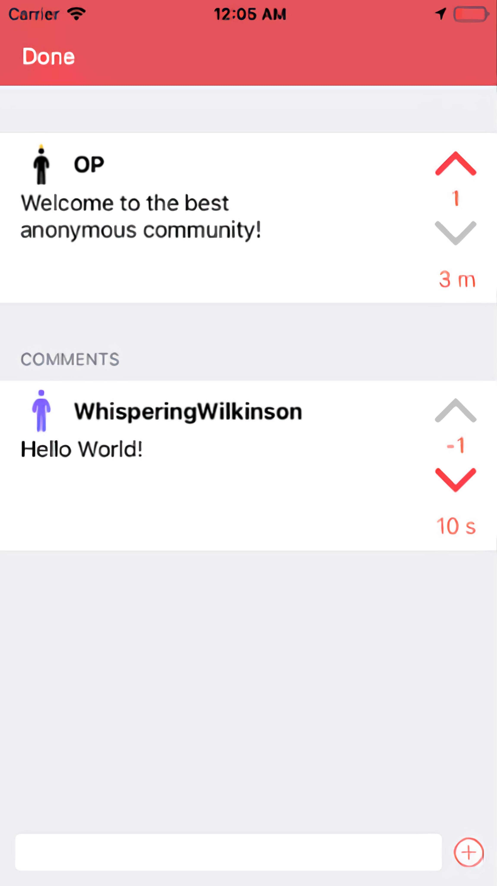
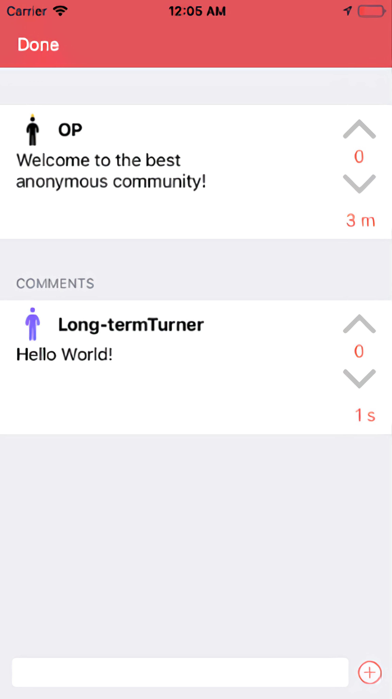
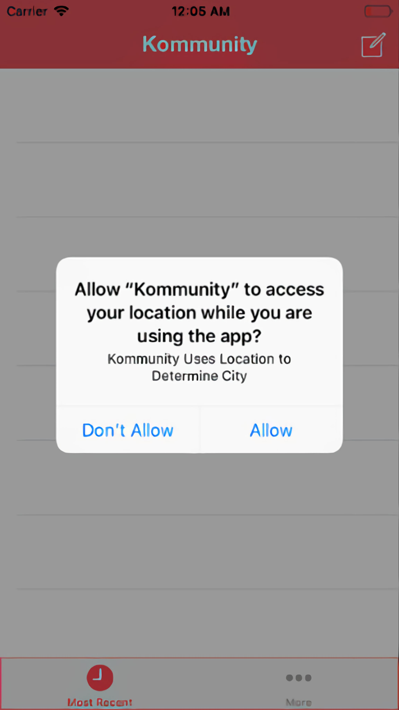
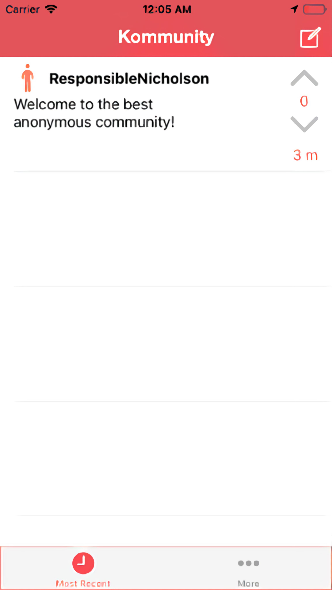

# Overview

This video is about an app I made called Kommunity! Kommunity is an upcoming trendy location-based social network. Some may state it resembles YikYak? But, Kommunity takes being anonymous very seriously. This app runs off of unique usernames that are generated per post or per post thread for comments. Therefore, it is physically untraceable to connect different posts with the same user. The app also implements Upvotes and Downvotes and is also based off of city location. The only thing that is sent up to the cloud is the city you are in.

# Demo Video

# Tech Stack

- Swift iOS App
- MySQL Database
- PHP Backend

# Screenshots

